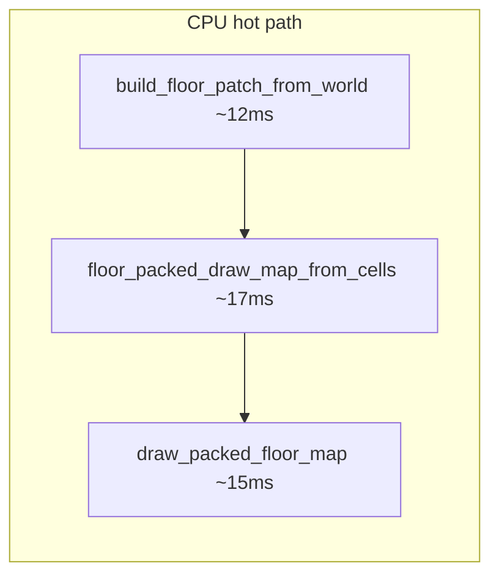
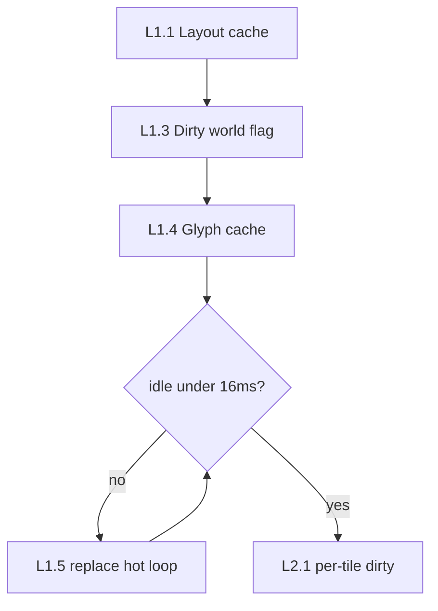

# Level editor — производительность

CPU-редактор уровней (`scripts/level_editor.py`): каждый кадр полностью перерисовывает viewport (packed diamond) + палитру + инспектор. Overworld GPU-бюджеты из [`PERFORMANCE.md`](PERFORMANCE.md) сюда **не относятся**.

## Замер (профилировщик)

```bash
python scripts/profile_level_editor.py --frames 30
python scripts/profile_level_editor.py --bench-only   # только подсистемы, без UI
```

Патч по умолчанию: **25×25** diag tiles → **2500** packed-ячеек на экране (`editor_floor_patch_tiles()`, 5 m).

### До оптимизации (v0.3.0, до кэша layout)

| Метрика | Значение |
|---------|----------|
| Кадр (25×25) | **~2740 ms** (~0.4 FPS) |
| `build_tile_slot_screen_map` | **~566 ms** × **3**/кадр |
| `screen_row_tile_slot` | **~184M** вызовов на один пересчёт |
| `build_floor_patch_from_world` | ~6 ms |
| `draw_packed_floor_map` (pygame) | ~11 ms |

**Причина:** `_build_stamp_layout()` для больших патчей сканирует экранные строки с `_find_stamp_anchor_fwd` (O(n²) по экрану). Layout пересчитывался **трижды за кадр**: draw map, pick map, подсветка выделения.

### После кэша layout (текущее состояние)

| Метрика | Значение |
|---------|----------|
| Кадр (25×25) | **~45 ms** (~22 FPS) |
| `build_tile_slot_screen_map` (холодный) | ~11 ms, далее из кэша |
| `build_world_packed_draw_map` | ~15 ms |
| `draw_packed_floor_map` | ~12 ms |
| layout за кадр | **1×** `resolve_tile_slot_view` (~0.3 ms из кэша) |

Реализовано:

- `_STAMP_LAYOUT_CACHE` в `src/engine/layout/screen_slots.py` — кэш сырого stamp-layout по `n_tiles`
- `draw_diag_viewport` — один `slot_view` на кадр; pick map через `packed_pick_map_from_slot_view`
- `floor_packed_draw_map_from_cells(..., slot_view=...)` — без повторного resolve

## Текущее распределение (~45 ms/кадр)



| Этап | ~ms | Примечание |
|------|-----|------------|
| `build_floor_patch_from_world` | 12 | `floor_stamp_tile_owners` + 3900× `get_column` |
| `floor_packed_draw_map_from_cells` | 17 | в т.ч. `dataclasses.replace` ×2500 |
| `draw_packed_floor_map` | 15 | `font.render` ×2500, `draw.rect` ×2500 |
| UI (палитра, инспектор, status) | 2 | `font.render` на каждый кадр |
| layout | &lt;1 | из кэша |

Pygame `display.flip()` в интерактивном режиме добавляет vsync/SDL overhead (не входит в headless-профиль).

## План оптимизации

### Фаза L1 — быстрые победы (цель: стабильные 60 FPS idle на 25×25)

| # | Задача | Ожидаемый выигрыш | Статус |
|---|--------|-------------------|--------|
| L1.1 | Кэш `_build_stamp_layout(n)` | 2700 ms → 45 ms | ✅ |
| L1.2 | Один `slot_view` на кадр | убрать 3× layout | ✅ |
| L1.3 | **Dirty-флаг мира** — не пересобирать `draw_map`, пока `EditableWorld` не менялся | idle ~45 ms → **~15 ms** | 🔲 |
| L1.4 | **Кэш глифов** `{(ch, fg): Surface}` в `draw_packed_floor_map` | −10…15 ms на draw | 🔲 |
| L1.5 | Убрать `dataclasses.replace` в hot loop — собирать `FloorGlyphCell` напрямую | −5…10 ms | 🔲 |
| L1.6 | Кэш `floor_stamp_tile_owners(n, feet)` по размеру патча | −2 ms на rebuild | 🔲 |

**Критерий L1:** `profile_level_editor.py --frames 30` — mean **&lt; 16 ms** на 25×25 при неизменной карте (idle).

### Фаза L2 — инкрементальные обновления

| # | Задача | Описание |
|---|--------|----------|
| L2.1 | Dirty по тайлу | После paint/erase пересобирать только 4 stamp-слота затронутого `(tx, ty)` |
| L2.2 | Кэш inspector | Не вызывать `inspect_diag_tile` каждый кадр, только при смене выделения |
| L2.3 | Статический слой viewport | Отрисовывать пол в offscreen `Surface`, блитить; перерисовывать при dirty |
| L2.4 | UI throttle | Палитра/инспектор — только при hover/изменении state |

### Фаза L3 — алгоритм layout (большие патчи 32×32…64×64)

| # | Задача | Описание |
|---|--------|----------|
| L3.1 | Прямая формула slot → packed | Заменить `_find_stamp_anchor_fwd` scan на closed-form из `screen_row_tile_slot` |
| L3.2 | Холодный старт 64×64 | Сейчас первый `_build_stamp_layout(64)` может занимать секунды; прекомпут при смене размера + progress в status bar |
| L3.3 | Perf-тест gate | `tests/performance/test_level_editor_frame_budget.py` — headless, patch 25×25, mean &lt; 16 ms |

### Фаза L4 — продукт

| # | Задача |
|---|--------|
| L4.1 | Опциональный GPU floor preview (как biome_viewer) для патчей &gt; 40×40 |
| L4.2 | `PEPELNY_EDITOR_FLOOR_METERS` в status bar + предупреждение при &gt; 5 m |
| L4.3 | F4 overlay в level editor (как в игре): ms draw_map / ms blit / dirty |

## Рекомендуемый порядок работ



1. **L1.3** dirty-флаг — максимальный эффект при простое (панорама, выделение без правок)
2. **L1.4** glyph cache — дешёво, сразу ускоряет draw
3. **L1.5** убрать `replace` — чистка hot path
4. Замер → при необходимости **L2** incremental
5. Параллельно **L3.1** если планируются патчи &gt; 32

## Связанные модули

| Модуль | Роль |
|--------|------|
| `scripts/profile_level_editor.py` | Headless cProfile + subsystem bench |
| `src/world/editor/ui/viewport.py` | `draw_diag_viewport`, `build_world_packed_draw_map` |
| `src/engine/layout/screen_slots.py` | `_STAMP_LAYOUT_CACHE`, `build_tile_slot_screen_map` |
| `src/engine/layout/golden.py` | `resolve_tile_slot_view` (5×5 golden / n&gt;5 screen-row) |
| `src/engine/floor/draw_map.py` | `floor_packed_draw_map_from_cells` |
| `src/engine/viewport/floor.py` | `draw_packed_floor_map` |

## Тесты

- `tests/unit/test_level_editor_ui.py` — viewport + pick
- `tests/unit/test_alphabet_floor_render.py` — golden 5×5 render regression
- `tests/regression/test_level_editor_startup.py` — smoke one frame

Планируется: `tests/performance/test_level_editor_frame_budget.py` (фаза L3.3).

## См. также

- [`LEVEL_EDITOR.md`](LEVEL_EDITOR.md) — UI и управление
- [`ENGINE.md`](ENGINE.md) — слои `src/engine/`
- [`ISO_LAYOUT.md`](ISO_LAYOUT.md) — packed layout и golden
- [`PERFORMANCE.md`](PERFORMANCE.md) — overworld GPU gate
