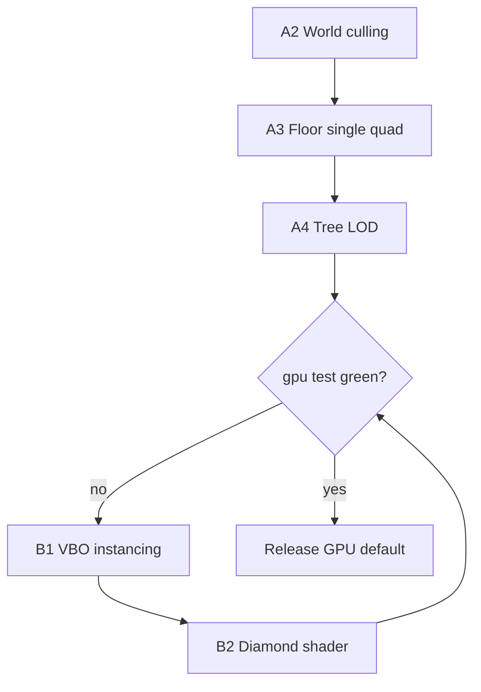

# Производительность (v0.3+)

## Текущий gate (v0.3.1, Windows, seed 4242)

`test_overworld_gpu_full_frame_under_16ms` — **PASS** (см. `assets/debug/baseline_gpu.json`).

| Метрика | Было (до A1) | Сейчас (bench) | Gate |
|---------|--------------|----------------|------|
| **full frame** | ~410 ms | mean **4.6 ms**, p95 **6.1 ms** | mean < 16, p95 < 24 |
| **gpu_map** | ~290 ms | **0.3 ms** (vertex cache) | < 16 ms |
| **gpu_batch** | ~44 000 → 28k | **~2059** | ≤ 8000 |
| **draw_queue** | ~2140 | **~2054** | — |
| map_draw (CPU) | ~12 ms | **~0.2 ms** (GPU path) | < 16 ms |

Путь кадра (GPU gameplay):

```
ow_input → map_queue (cache hit) → gpu_map (VBO cache) → gpu_ui → gpu_swap
```

Бенчмарк (`PEPELNY_BENCH=1`): walk warmup → stand still measure, `PEPELNY_GPU_SPLAT=1`, vsync off, tile-snapped camera.

## GPU floor: footprint + stencil (два слоя)

Мировая клетка на экране — **ромб** (2:1 iso), не axis-aligned квадрат. Footprint только diamond (`iso_footprint.py`); см. `docs/ISO_LAYOUT.md`.

| Слой | CPU | GPU (default) | Назначение |
|------|-----|---------------|------------|
| **Footprint (грунт)** | `fill_iso_footprint` — solid `bg` во всех char-ячейках ромба | bbox undercoat + **diamond clip** в fragment shader | Непрерывный пол без «ушей» AABB по краям viewport |
| **Stencil (декор)** | glyph stamp поверх | diamond splat + atlas UV | Трава/камень в центре |

Щели в biome_viewer появлялись при **splat без footprint**: atlas stencil полупрозрачен между глифами, а ромбы не перекрываются на пикселях.

`PEPELNY_GPU_FLOOR_MODE`:

| Значение | Quads/пол | Описание |
|----------|-----------|----------|
| `undercoat` (default) | 2 | undercoat + diamond splat (как CPU) |
| `opaque_splat` | 2 | clipped undercoat + diamond `splat:id` (bake = CPU footprint) |
| `glyphs` | ~10+ | per-cell footprint + glyph quads (`PEPELNY_GPU_SPLAT=0` эквивалент) |

Тесты покрытия: `tests/unit/test_biome_viewer_gpu_coverage.py`, `tests/unit/test_gpu_atlas_splat.py`, `tests/unit/test_gpu_floor_pixel_mask.py` (пиксельная маска ромба, `meadow_preview` 14×14).

## История: почему игра была ~400 ms

До v0.3.1 тесты проверяли **CPU `map_draw`** (~10–12 ms) и **iso CPU** с бюджетом **165 ms**.  
Узкое место: **gpu_batch ~28k** — footprint + per-glyph stencil quads.  
Фиксы: atlas splat (1 diamond/tile), screen cull, tree LOD, VBO reuse, vertex cache.

## Цели

| Метрика | Бюджет | Env |
|---------|--------|-----|
| **Полный кадр (GPU gameplay)** | mean **< 16 ms**, p95 **< 24 ms** | `PEPELNY_PERF_MEAN_MS`, `PEPELNY_PERF_P95_MS` |
| **gpu_map** (GL draw) | **< 16 ms** | `PEPELNY_GPU_MAP_MS` |
| **gpu_batch** (quads/frame) | **≤ 8000** | `PEPELNY_GPU_BATCH_MAX` |
| **fov_los** | **< 10 ms** | `PEPELNY_FOV_LOS_MS` |
| **Отклик ввода** | **< 1 ms** | input phase (будущий счётчик) |
| iso CPU (debug) | только с `PEPELNY_TEST_ISO_CPU=1` | не целевой путь |

**1 ms на весь кадр** — нереалистичный идеал; **16 ms** — обязательный gate для merge.

## Тесты (обязательный gate)

```
tests/performance/
├── test_overworld_gpu_perf.py       # ★ ГЛАВНЫЙ: full frame < 16 ms + gpu_map + gpu_batch
├── test_overworld_walk_perf.py      # fov_los, stages (frame budget только с PEPELNY_TEST_ISO_CPU)
├── test_overworld_pan_perf.py
├── test_fov_visible_radius_budget.py
└── test_fov_radius_100_budget.py
```

```bash
# Локально (как в игре)
set PEPELNY_RENDER=gpu
python -m pytest tests/performance/test_overworld_gpu_perf.py -v

# Полный perf
python -m pytest tests/performance/ -q

# Отчёт
python scripts/run_perf_benchmark.py
```

**PR не мержить**, пока `test_overworld_gpu_full_frame_under_16ms` красный (см. `.cursor/rules/testing.mdc`).

CI: `xvfb-run` + Mesa software GL, `PEPELNY_RENDER=gpu`.

Обход только для локальной отладки: `PEPELNY_SKIP_GPU_PERF=1` (не для merge).

## Диагностика F4

Смотреть в порядке:

1. **Frame / mean / p95** — полный кадр  
2. **gpu_batch** — число квадов (главный предиктор лагов)  
3. **gpu_map** — время GL  
4. **map_queue / map_draw** — CPU (обычно OK)  
5. **fov_los** — FOV (обычно OK после r=32)

Не путать: **map_draw 12 ms** ≠ **игра 400 ms** при GPU.

---

# План оптимизации (подробный)

## Фаза A — срочно (0.3.1): gpu_batch < 8000

### A1. Footprint: 1 quad на тайл ✅

`iso_footprint_pixel_rect` → один bbox-quad. 44k → 28k quads.

### A2. Viewport culling ✅

- `ISO_QUEUE_WORLD_MARGIN=2` (`PEPELNY_ISO_MARGIN`) в `world_bounds_for_focus`
- Screen cull в `GpuIsoRenderer.draw` до stamp

### A3. Atlas splat ✅

`PEPELNY_GPU_SPLAT=1` (default): `_append_atlas_splat` / `append_diamond_splat_15` — 1 diamond quad/tile, UV из `AtlasRegion`.  
Откат: `PEPELNY_GPU_SPLAT=0`. Тесты: `tests/unit/test_gpu_atlas_splat.py`.

### A4. LOD деревьев ✅

Дальше `tree_lod_distance_tiles()` (default 8): cheap `tree` stencil вместо canopy.

### A5. Таймеры / bench GL ✅

`gpu_map` / `gpu_swap` / `display_ms` split; `SDL_GL_SWAP_INTERVAL=0` при `PEPELNY_BENCH=1`.

**Критерий фазы A:** `test_overworld_gpu_full_frame_under_16ms` — **зелёный**.

---

## Фаза B — рендер (0.3.2)

### B1. VBO reuse ✅ (bench)

`byte_buffer()` zero-copy upload, `draw_interleaved_from_builder`, GPU vertex cache по `queue_cache_key`.

### B2. Diamond ground shader ✅

Fragment `inside_diamond` discard; `append_diamond_splat_15` mesh.

### B3. Explored fog на GPU — отложено

`PEPELNY_GPU_FOV` / explored texture — будущая работа.

### B4. UI batch

`ui_quads ≈ 300` в bench; в игре ~2600 — цель **< 2 ms** mean.

---

## Фаза C — CPU очередь (0.3.3)

### C1. Кэш draw_queue ✅ (bench)

Bench signature: `(ptx, pty, layer)`; skip invalidate on chunk load при `PEPELNY_BENCH=1`.

### C2. Memo `get_column` ✅ (per-frame)

`WorldMap._column_cache` в `begin_frame`/`end_frame`; bench steady-state ≈ 1 call/frame.

### C3. Предзагрузка чанков ✅

`LocomotionController._preload_chunks_ahead` по velocity vector.

---

## Фаза D — продукт (0.4)

| Задача | Статус |
|--------|--------|
| GPU default | ✅ `PEPELNY_RENDER=gpu` default в `render_mode.py` |
| Quality presets | ✅ `PEPELNY_QUALITY=low\|medium\|high` → `apply_quality_preset()` |
| F4 split timers | ✅ `gpu_map` / `gpu_swap` / `display_ms` |
| Input phase timer | ✅ `ow_input` в F4 HUD |

---

## Порядок работ (рекомендуемый)



1. **A2** viewport cull (макс. эффект за день)  
2. **A3** убрать двойной floor draw  
3. **A4** tree LOD  
4. Замер → если всё ещё >16 ms → **B1–B2**  
5. Параллельно **C1–C2** (не блокирует GPU, но снижает map_queue)

---

## Команды и env

| Переменная | Default | Описание |
|------------|---------|----------|
| `PEPELNY_RENDER` | `gpu` | Рендер overworld |
| `PEPELNY_GPU_SPLAT` | `1` | Atlas splat (1 quad/tile) |
| `PEPELNY_GPU_FLOOR_MODE` | `undercoat` | `undercoat` \| `opaque_splat` \| `glyphs` |
| `PEPELNY_BENCH` | — | Bench: vsync off, queue/vertex cache, stand-still measure |
| `PEPELNY_VISIBLE_LOS` | `32` | FOV radius (bench: `24`) |
| `PEPELNY_PERF_MEAN_MS` | `16` | Mean frame gate |
| `PEPELNY_PERF_P95_MS` | `24` | p95 frame gate |
| `PEPELNY_GPU_BATCH_MAX` | `8000` | gpu_batch gate |
| `PEPELNY_SKIP_GPU_PERF` | — | Локальный skip (не CI) |
| `PEPELNY_TEST_ISO_CPU` | — | 165 ms gate на iso CPU |

## Level editor (CPU, отдельный контур)

Редактор уровней **не** использует GPU overworld path. Патч 25×25 = 2500 pygame blit/кадр.

| Метрика | До кэша layout | После (v0.3+) |
|---------|----------------|---------------|
| Кадр 25×25 | ~2740 ms | **~45 ms** |

Подробный план (dirty-флаг, glyph cache, perf gate): **[`LEVEL_EDITOR_PERFORMANCE.md`](LEVEL_EDITOR_PERFORMANCE.md)**.

```bash
python scripts/profile_level_editor.py --frames 30
```

---

## Ссылки

- `src/render/gpu/iso_renderer.py` — gpu_batch  
- `src/render/gpu/presenter.py` — gpu_map timer  
- `src/scenes/overworld/map_renderer.py` — draw_queue  
- `src/core/perf_benchmark.py` — бюджеты  
- `tests/performance/test_overworld_gpu_perf.py` — gate  
- `docs/LEVEL_EDITOR_PERFORMANCE.md` — level editor CPU  
- `scripts/profile_level_editor.py` — профилировщик редактора
