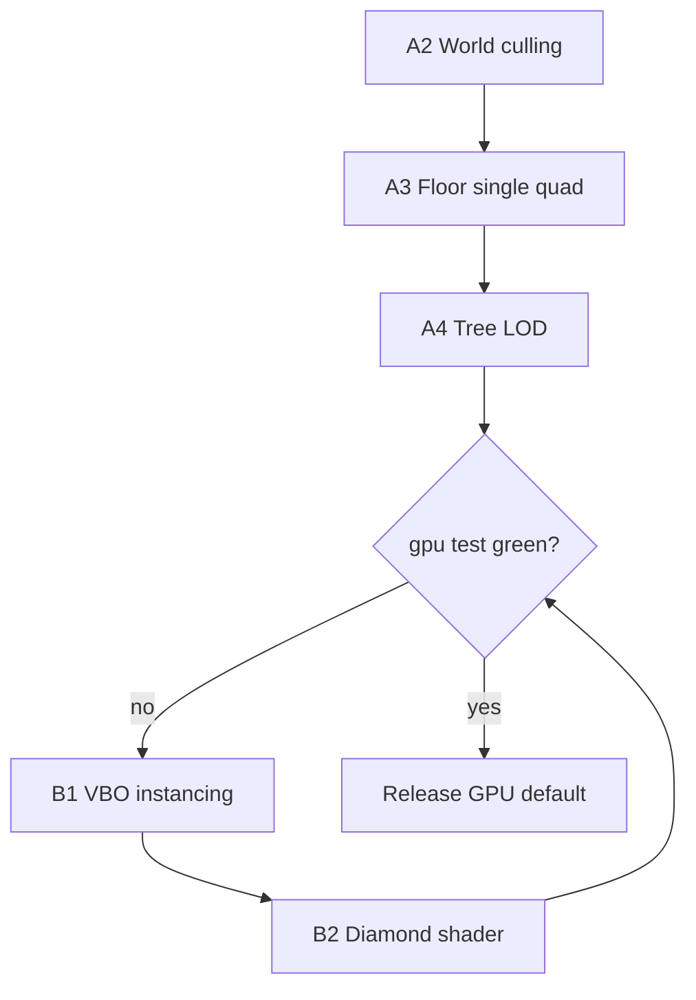

# Производительность (v0.3+)

## Почему игра ~400 ms, а тесты были зелёные

До v0.3.1 тесты проверяли **CPU `map_draw`** (~10–12 ms) и **iso CPU** с бюджетом **165 ms**.  
В игре при `PEPELNY_RENDER=gpu` кадр идёт другим путём:

```
handle_input → map_queue (~11 ms) → map_draw CPU buffer (~12 ms)
    → gpu_map: GpuIsoRenderer.draw (~330 ms)  ← узкое место
    → gpu_ui (~3 ms) → flip
```

F4 HUD: **GPU: карта** и **Present** — это **один и тот же GPU-проход**, не «vsync 400 ms при логике 12 ms».  
**gpu_q ≈ 44 000** (после первого фикса footprint ~28 000) — слишком много квадов на кадр.

| Счётчик | Было | После 1-го фикса footprint | Цель |
|---------|------|------------------------------|------|
| gpu_batch | ~44 000 | ~28 000 | **≤ 8 000** |
| gpu_map | ~367 ms | ~333 ms | **< 16 ms** |
| map_draw (CPU) | ~12 ms | ~12 ms | < 16 ms |
| full frame | ~412 ms | ~353 ms | **< 16 ms** |

## Цели

| Метрика | Бюджет | Env |
|---------|--------|-----|
| **Полный кадр (GPU gameplay)** | mean **< 16 ms**, p95 **< 24 ms** | `PEPELNY_PERF_MEAN_MS`, `PEPELNY_PERF_P95_MS` |
| **gpu_map** (GL draw) | **< 16 ms** | `PEPELNY_GPU_MAP_MS` |
| **gpu_batch** (quads/frame) | **≤ 8000** | `PEPELNY_GPU_BATCH_MAX` |
| **fov_los** | **< 10 ms** | `PEPELNY_FOV_LOS_MS` |
| **Отклик ввода** | **< 1 ms** | input phase (будущий счётчик) |
| iso CPU (debug) | только с `PEPELNY_TEST_ISO_CPU=1` | не целевой путь |

**1 ms на весь кадр** — нереалистичный идеал; **16 ms** — обязательный gate для merge.

## Тесты (обязательный gate)

```
tests/performance/
├── test_overworld_gpu_perf.py       # ★ ГЛАВНЫЙ: full frame < 16 ms + gpu_map + gpu_batch
├── test_overworld_walk_perf.py      # fov_los, stages (frame budget только с PEPELNY_TEST_ISO_CPU)
├── test_overworld_pan_perf.py
├── test_fov_visible_radius_budget.py
└── test_fov_radius_100_budget.py
```

```bash
# Локально (как в игре)
set PEPELNY_RENDER=gpu
python -m pytest tests/performance/test_overworld_gpu_perf.py -v

# Полный perf
python -m pytest tests/performance/ -q

# Отчёт
python scripts/run_perf_benchmark.py
```

**PR не мержить**, пока `test_overworld_gpu_full_frame_under_16ms` красный (см. `.cursor/rules/testing.mdc`).

CI: `xvfb-run` + Mesa software GL, `PEPELNY_RENDER=gpu`.

Обход только для локальной отладки: `PEPELNY_SKIP_GPU_PERF=1` (не для merge).

## Диагностика F4

Смотреть в порядке:

1. **Frame / mean / p95** — полный кадр  
2. **gpu_batch** — число квадов (главный предиктор лагов)  
3. **gpu_map** — время GL  
4. **map_queue / map_draw** — CPU (обычно OK)  
5. **fov_los** — FOV (обычно OK после r=32)

Не путать: **map_draw 12 ms** ≠ **игра 400 ms** при GPU.

---

# План оптимизации (подробный)

## Фаза A — срочно (0.3.1): gpu_batch < 8000

### A1. Footprint: 1 quad на тайл вместо 10 ячеек ✅ (частично)

`GpuIsoRenderer`: `iso_footprint_pixel_rect` → один bbox-quad.  
Эффект: 44k → 28k quads. **Недостаточно** — нужны A2–A4.

### A2. Viewport culling в world space

**Проблема:** `draw_queue` ~2140 тайлов, почти все попадают в GPU.  
**Решение:** в `GpuIsoRenderer.draw` / `build_iso_draw_queue`:

- Отсечь тайлы вне `camera.view_origin() ± (vw+margin, vh+margin)` в мировых координатах  
- Margin = 2 тайла для высоких объектов  
- Ожидание: queue **2140 → 400–600**, gpu_batch **28k → 5k–8k**

Файлы: `map_renderer.py`, `iso_renderer.py`, `viewport.py`

### A3. Убрать дублирование footprint + stencil glyphs

**Проблема:** для floor tile: 1 footprint quad + N glyph quads из stencil (grass).  
**Решение (выбрать одно):**

- **Вариант 1:** GPU floor = только footprint tint, без glyph stencil (текстура травы в atlas tile)  
- **Вариант 2:** только glyph quads, без footprint fill (дыры между ромбами — отдельный ground pass)  
- **Вариант 3:** один «tile splat» в atlas 2×1 на биом, 1 quad на тайл

Ожидание: **÷2–3** quads на ground.

### A4. LOD деревьев и объектов

- Дальше N тайлов: `T` → один символ `^` или billboard  
- Не разворачивать полный tree stencil (10+ glyphs) вне ближнего кольца  
- Файлы: `map_renderer.py`, `tree_generator.py`, `gpu/iso_renderer.py`

### A5. Отключить vsync в бенчмарке / debug

`SDL_GL_SWAP_INTERVAL=0` при `PEPELNY_BENCH=1` — flip не раздувает таймер, если драйвер ждёт 60 Hz.  
Не ускоряет gpu_map, но честнее меряет на F4.

**Критерий фазы A:** `test_overworld_gpu_full_frame_under_16ms` зелёный на Windows + CI Mesa.

---

## Фаза B — рендер (0.3.2): gpu_map < 8 ms

### B1. Один VBO upload, один draw call

Сейчас: `FloatBufferBuilder` → до 27k verts × 15 floats → upload каждый кадр.  
**Решение:**

- Persistent mapped buffer / orphan + `buffer.write` только dirty region  
- Или instancing: tile index buffer + atlas UV table (GL 3.3 compatible)

### B2. Diamond ground shader

Вместо bbox footprint — fragment shader clip по ромбу 2:1, **1 quad = 1 world tile** с правильной формой.  
Убирает артефакты bbox и готовит terrain mesh.

### B3. Explored fog на GPU

`PEPELNY_GPU_FOV` / explored texture — multiply в fragment, без CPU fog stamp.  
Снимает `map_fog` с CPU path.

### B4. UI batch

`ui_q ≈ 2600` — отдельный батч, не в gpu_map; цель **< 2 ms**.

---

## Фаза C — CPU очередь (0.3.3)

### C1. Расширить кэш draw_queue

Инвалидация только: `visible_version`, dirty chunks, layer, camera tile (не каждый sub-tile stride).

### C2. Memo `get_column`

~1800 вызовов/кадр → кэш на (chunk_x, chunk_y, layer) поколение.

### C3. Предзагрузка чанков по velocity

`LocomotionController` → вектор движения → `ensure_chunk` на 1–2 чанка вперёд.

---

## Фаза D — продукт (0.4)

| Задача | Описание |
|--------|----------|
| GPU default | `PEPELNY_RENDER=gpu` в релизном билде |
| Quality presets | Low: batch≤4k, no shadows; High: full stencils |
| F4 split timers | `gpu_map` / `gpu_upload` / `gpu_draw` / `swap` отдельно |
| Input phase timer | `ow_input` < 1 ms в HUD |

---

## Порядок работ (рекомендуемый)



1. **A2** viewport cull (макс. эффект за день)  
2. **A3** убрать двойной floor draw  
3. **A4** tree LOD  
4. Замер → если всё ещё >16 ms → **B1–B2**  
5. Параллельно **C1–C2** (не блокирует GPU, но снижает map_queue)

---

## Команды и env

| Переменная | Значение |
|------------|----------|
| `PEPELNY_RENDER` | `gpu` для игры |
| `PEPELNY_PERF_MEAN_MS` | `16` |
| `PEPELNY_GPU_BATCH_MAX` | `8000` |
| `PEPELNY_SKIP_GPU_PERF` | `1` — только локально, не CI |
| `PEPELNY_TEST_ISO_CPU` | `1` — включить 165 ms gate на iso CPU |

## Ссылки

- `src/render/gpu/iso_renderer.py` — gpu_batch  
- `src/render/gpu/presenter.py` — gpu_map timer  
- `src/scenes/overworld/map_renderer.py` — draw_queue  
- `src/core/perf_benchmark.py` — бюджеты  
- `tests/performance/test_overworld_gpu_perf.py` — gate
